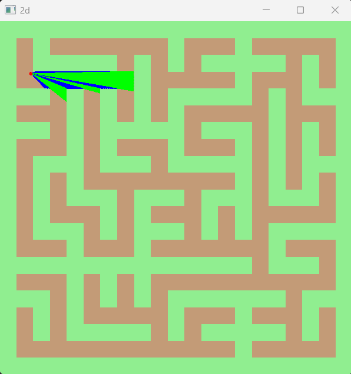

# Raycasting 3D Engine in C++ (2021)


This is a simple 3D Raycasting engine implemented from scratch in C++, utilizing the SFML library for graphics rendering. The engine provides both a 3D perspective view and a 2D top-down map generated using a random path-fusion algorithm.

## Features

- **3D Raycasting Perspective :**
  The engine generates a 3D perspective view using the classic Raycasting technique.

- **2D Top-Down Map :**
  A 2D map is displayed alongside the 3D view, offering a top-down perspective of the randomly generated environment.

- **Random Map Generation :**
  The project incorporates an algorithm for random map generation using path-fusion techniques.

## Project Structure

- **/src :**
  - `2d.cpp`: Implementation of the 2D view.
  - `3d.cpp`: Implementation of the 3D Raycasting engine.
  - `Raycast.cpp`: Main file handling window creation and event loops.

- **/include :**
  - `2d.h`: Header file for the 2D view.
  - `3d.h`: Header file for the 3D Raycasting engine.

- **Raycasting.sln, Raycasting.vcxproj, Raycasting.vcxproj.filters, Raycasting.vcxproj.user :**
  Visual Studio project files.

- **CMakeLists.txt :**
  CMake configuration file for building the project with SFML 2.6.0.

- **README.md :**
  This file, containing project information, instructions, and usage details.

- **.gitignore :**
  Specifies files and directories to be ignored by Git, including build artifacts.

## Building the Project

To build the project, use CMake and follow these steps :

1. **Clone the Repository :**

```bash
git clone https://github.com/Atafid/Raycast-Motor.git
```

2. **Navigate to the Project Directory :**

```bash
cd Raycast-Motor
```

3. **Create a Build Directory :**

```bash
mkdir build
cd build
```

4. **Run CMake :**

```bash
cmake ..
```

5. **Build the Project :**

```bash
cmake --build .
```

6. **Copy dlls :**

```bash
cp _deps/sfml-build/lib/sfml-window-d-2.dll Debug/
cp _deps/sfml-build/lib/sfml-graphics-d-2.dll Debug/
cp _deps/sfml-build/lib/sfml-system-d-2.dll Debug/
```

7. **Run the Executable :**

```bash
./Debug/Raycast-Motor
```

## Usage

- **Movement :**
- Use `W` to move forward.
- Use `A` to move left.
- Use `S` to move backward.
- Use `D` to move right.

- **Mouse Movement :**
- Move the mouse to change the view direction.

## Screenshots

### 3D Perspective View
<p align="center">
	
</p>

### 2D Top-Down Map
<p align="center">
	
</p>


## Credits

- Project developed by Guillaume DI FATTA
